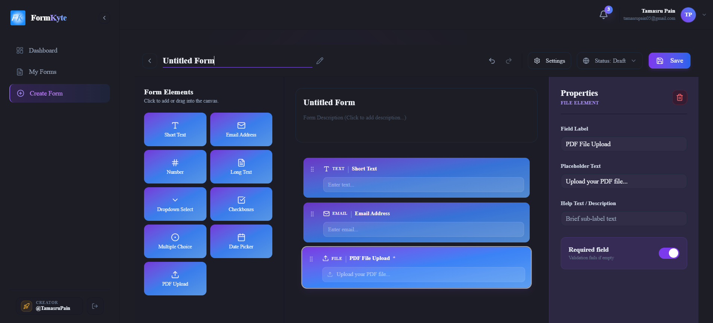
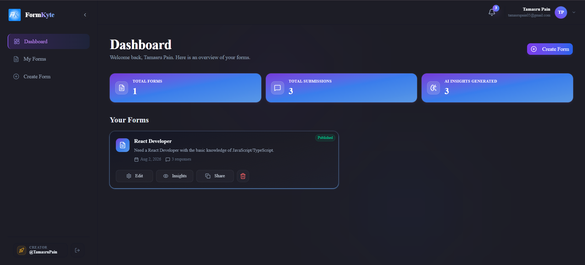
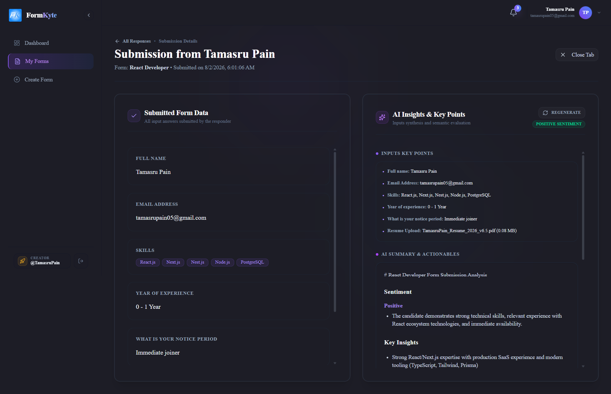

# ⚡ FormKyte

FormKyte is a premium, high-performance, developer-first SaaS platform designed to build interactive forms, capture respondent data, and analyze results in real time with advanced, asynchronous AI models. Featuring a stunning dark-mode slate-violet aesthetic inspired by the **Expenso UI**, FormKyte provides a smooth, drag-and-drop form building experience coupled with deep analytical tools.

[](https://nextjs.org/)
[](https://react.dev/)
[](https://www.prisma.io/)
[](https://tailwindcss.com/)
[](https://www.better-auth.com/)
[](https://upstash.com/)

---

## 📸 Screenshots

Below are visual previews of FormKyte's core pages and workflows, imported from the `public` directory:

<p align="center">
  
</p>
<p align="center">
  
</p>
<p align="center">
  
</p>

---

## ⚠️ Critical Architecture Note: Routing & Middleware

> [!IMPORTANT]
> **Custom Routing Proxy (`src/proxy.ts`):**
> Path protection and session routing in this application are controlled via the custom routing script at `src/proxy.ts`. Due to breaking updates and deprecations regarding standard middleware routing configurations in recent Next.js updates:
> * **DO NOT modify `src/proxy.ts`** or attempt to rewrite it into a standard `middleware.ts`.
> * Doing so will break the session checks and verification flows for Better Auth page redirection.

---

## 🌟 Key Features

* **Compact Drag-and-Drop Canvas**: Built with `@dnd-kit/core` and `Zustand` state management. Offers a space-efficient builder palette supporting:
  * Text, Email, Number, Textarea, Select, Checkbox, Radio, Date, and PDF Upload (`.pdf`) fields.
* **Dynamic Inline Editing**: Click or double-click form titles, canvas labels, and descriptions directly inside the form builder workspace to make instant changes.
* **Expenso UI Dark Violet Palette**: Fully curated theme incorporating sleek dark slate backgrounds, violet and purple borders, and ambient glassmorphic glows.
* **Interactive Framer-Motion Layouts**: Users can render published forms in standard scrollable lists or single-page slide-transition views.
* **Upstash Redis Caching Layer**: Public-facing embed pages read from Redis cache via `src/lib/cache.ts`, bypassing heavy PostgreSQL lookups to deliver sub-millisecond response loads.
* **Decoupled AI Pipeline with QStash**: Form submissions publish tasks to Upstash QStash, executing AI insight webhooks asynchronously to prevent connection timeouts.
* **Intelligent Live Notifications**: Polling navbar alerts fetch new submission details and intelligently parse submitted form answers to display respondent names and emails.
* **Privacy-First Submission Metrics**: Respondent IP addresses are anonymized via SHA-256 hashes, and browser header data is sanitized before database insertion to comply with GDPR requirements.
* **SMTP Notification Delivery**: Uses Nodemailer to automatically dispatch beautiful HTML email alerts containing form answers and detail dashboard links to form creators.

---

## 🗺️ Project Structure

```text
├── prisma/
│   ├── schema.prisma        # Prisma Database Schema definitions
│   └── config.ts            # Dynamic direct URL database configuration
├── public/                  # Public assets, icons, and illustrations
└── src/
    ├── app/                 # App Router pages and API endpoints
    │   ├── (auth)/          # Authenticated route group (login, register, forgot/reset password)
    │   ├── (dashboard)/     # Workspace views (user dashboard, form builder, responses details)
    │   ├── api/             # Backend logic routes (forms, submit, auth, notifications, AI webhooks)
    │   ├── embed/           # Public form entry pages (embed by form slug)
    │   ├── globals.css      # Core styles & Tailwind CSS v4 variables
    │   └── layout.tsx       # Global root HTML wrapper
    ├── components/          # Reusable dashboard widgets, builder panels, and shared layouts
    ├── hooks/               # Custom React hooks (e.g. alerts, viewport trackers)
    ├── lib/                 # Service instances (auth, db, redis, qstash, openrouter, email, cache)
    ├── store/               # Zustand global state (builderStore, sidebarStore, toastStore)
    ├── types/               # TypeScript interfaces for forms and submission responses
    ├── validators/          # Input schema validators
    └── proxy.ts             # Custom router path/session proxy (Next.js Middleware replacement)
```

---

## 🗄️ Database Schema & Models

The system runs on a PostgreSQL database managed via **Prisma ORM**. The schemas are defined in `prisma/schema.prisma`:

* **`Form`**: Stores form structure, configurations (e.g. multi-step flags), and field schema definitions (as a JSON array).
* **`Response`**: Contains submission values, hashed IP addresses, submission timestamps, and AI-generated insight fields.
* **`User`**: Core user account mapping (Better Auth integration).
* **`Session`**: Tracked user security sessions.
* **`Account`**: Linked authentication providers and social OAuth credentials.
* **`Verification`**: Sign-up verification and password recovery tokens.

---

## 🔌 API Endpoints Reference

### Forms API
* `GET /api/forms` - Retrieves all forms owned by the active session.
* `POST /api/forms` - Creates a new, blank form.
* `GET /api/forms/[formId]` - Retrieves schema details for a specific form.
* `PATCH /api/forms/[formId]` - Updates form configuration, title, or field schema. Invalidates the Redis cache.
* `DELETE /api/forms/[formId]` - Deletes a form and invalidates its Redis cache.

### Submissions API
* `POST /api/submit/[formId]` - Accepts user submissions. Validates entries against the cached schema. Hashes respondent IP, saves responses to PostgreSQL, enqueues QStash tasks for AI summaries, and dispatches Nodemailer alerts.
* `GET /api/forms/[formId]/responses/[responseId]` - Retrieves details for a specific submission (including AI insights).

### AI Processing API
* `POST /api/ai/webhook` - Executed asynchronously by Upstash QStash. Parses submitted PDF attachments, calls OpenRouter, and updates the DB with markdown-formatted insights. Supports `x-dev-bypass: true` in local development to run synchronously.

### Notifications API
* `GET /api/notifications` - Polls the latest 20 submissions across all forms to construct navbar alerts, automatically extracting names and emails.

---

## 🚀 Setup & Installation Instructions

Follow these steps to run FormKyte locally:

### 1. Clone the repository
```bash
git clone https://github.com/your-username/formkyte.git
cd formkyte
```

### 2. Install dependencies
```bash
npm install
```

### 3. Setup Environment Variables
Create a `.env` file in the root directory and specify the following parameters:

```env
# ── App configuration ──
NEXT_PUBLIC_APP_URL="http://localhost:3000"

# ── Database (Neon PostgreSQL) ──
DATABASE_URL="postgresql://<user>:<password>@<neon-pooler-url>/neondb?sslmode=require"
DIRECT_URL="postgresql://<user>:<password>@<neon-direct-url>/neondb?sslmode=require"

# ── Auth (Better Auth) ──
# Generate a secret key via: openssl rand -hex 16
BETTER_AUTH_SECRET="your-better-auth-secret-key"
BETTER_AUTH_URL="http://localhost:3000"

# ── Google OAuth (Optional) ──
GOOGLE_CLIENT_ID="your-google-client-id"
GOOGLE_CLIENT_SECRET="your-google-client-secret"

# ── AI (OpenRouter API) ──
OPENROUTER_API_KEY="your-openrouter-api-key"

# ── Cache (Upstash Redis) ──
UPSTASH_REDIS_REST_URL="your-upstash-redis-rest-url"
UPSTASH_REDIS_REST_TOKEN="your-upstash-redis-rest-token"

# ── Job Queue (Upstash QStash) ──
QSTASH_URL="your-qstash-url"
QSTASH_TOKEN="your-qstash-token"
QSTASH_CURRENT_SIGNING_KEY="your-qstash-signing-key"
QSTASH_NEXT_SIGNING_KEY="your-qstash-next-signing-key"

# ── Email (SMTP Services) ──
SMTP_HOST="smtp.gmail.com"
SMTP_PORT=587
SMTP_USER="your-email@gmail.com"
SMTP_PASS="your-google-app-password"
SMTP_FROM="FormKyte Alerts <your-email@gmail.com>"
```

### 4. Push Database Schema & Generate Prisma Client
Sync the models to your Neon PostgreSQL instance:
```bash
npx prisma db push
```

### 5. Start Development Server
```bash
npm run dev
```
Open [http://localhost:3000](http://localhost:3000) in your browser.

---

## ⚡ Production Build Verification

To verify build logs and confirm the production package output:
```bash
npm run build
npm run start
```
